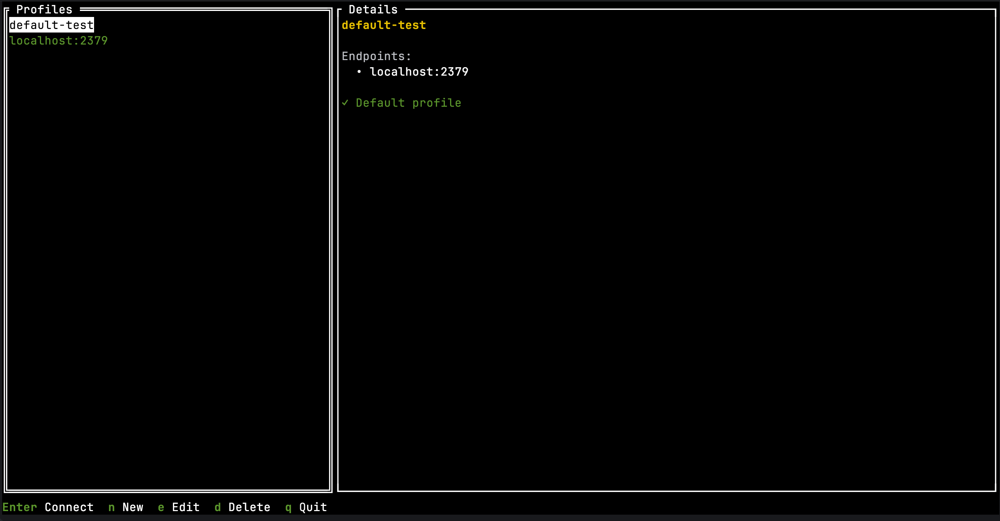
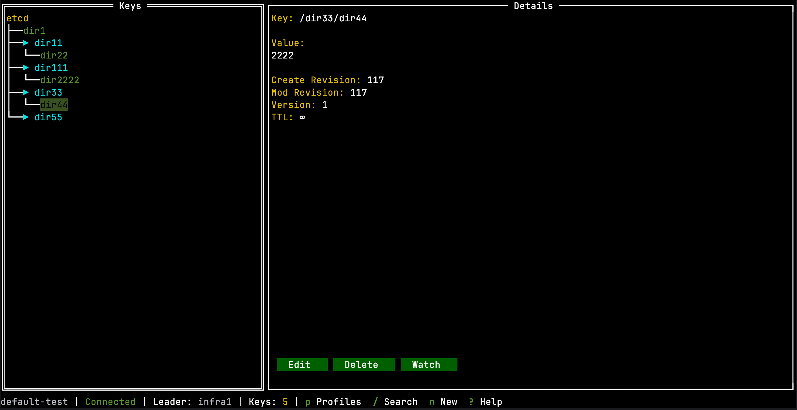

# etcdtui

Interactive terminal UI for etcd - browse, edit, and monitor your etcd cluster with ease.

[](https://go.dev/)
[](LICENSE)

## Features

- **Tree View** - Browse etcd keys in a hierarchical tree structure
- **CRUD Operations** - Create, read, update, and delete keys
- **Live Watch** - Monitor key changes in real-time
- **Prefix Search** - Search keys by prefix
- **Multiple Profiles** - Manage and switch between etcd clusters
- **Secure Auth** - Support for username/password and TLS certificates
- **Keyboard-Driven** - Efficient navigation

## Installation

### Homebrew (macOS & Linux)

```bash
brew install alex-dev-master/tap/etcdtui
```

### Go Install

```bash
go install github.com/alex-dev-master/etcdtui/cmd/etcdtui@latest
```

### Download Binary

Download the latest release from [GitHub Releases](https://github.com/alex-dev-master/etcdtui/releases).

### From Source

```bash
git clone https://github.com/alex-dev-master/etcdtui.git
cd etcdtui
make build
./bin/etcdtui
```

## Quick Start

```bash
# Start with profile selector
etcdtui

# Use specific profile
etcdtui -p production

# Show help
etcdtui --help
```

## Configuration

Config file: `~/.config/etcdtui/config.yaml`

```yaml
profiles:
  - name: local
    endpoints: ["localhost:2379"]
    default: true

  - name: production
    endpoints: ["etcd1.prod:2379", "etcd2.prod:2379"]
    username: admin
    password: "base64:YWRtaW4xMjM="  # base64 encoded
    tls:
      enabled: true
      ca_file: "/path/to/ca.crt"
      cert_file: "/path/to/client.crt"
      key_file: "/path/to/client.key"

  - name: staging
    endpoints: ["etcd.staging:2379"]
    username: readonly
    password: "base64:cGFzc3dvcmQ="
```

## Keyboard Shortcuts

### Profile Selection Screen

| Key | Action |
|-----|--------|
| `↑/↓` | Navigate profiles |
| `Enter` | Connect to profile |
| `n` | New profile |
| `e` | Edit profile |
| `d` | Delete profile |
| `q` | Quit |

### Main View

| Key | Action |
|-----|--------|
| `↑/↓` | Navigate tree |
| `Enter` | Expand/collapse node |
| `Tab` | Switch panels |
| `e` | Edit key |
| `d` | Delete key |
| `n` | New key |
| `r` | Refresh |
| `/` | Search by prefix |
| `w` | Watch mode |
| `p` | Switch profile |
| `?` | Show help |
| `F1` | Toggle debug panel |
| `q` | Quit |

## Screenshots





## Development

```bash
# Run without building
make run

# Run tests
make test

# Run linter
make lint

# Build for all platforms
make build-all

# Clean build artifacts
make clean
```

## Contributing

Contributions are welcome! Please feel free to submit a Pull Request.

## License

MIT License - see [LICENSE](LICENSE) file for details.
